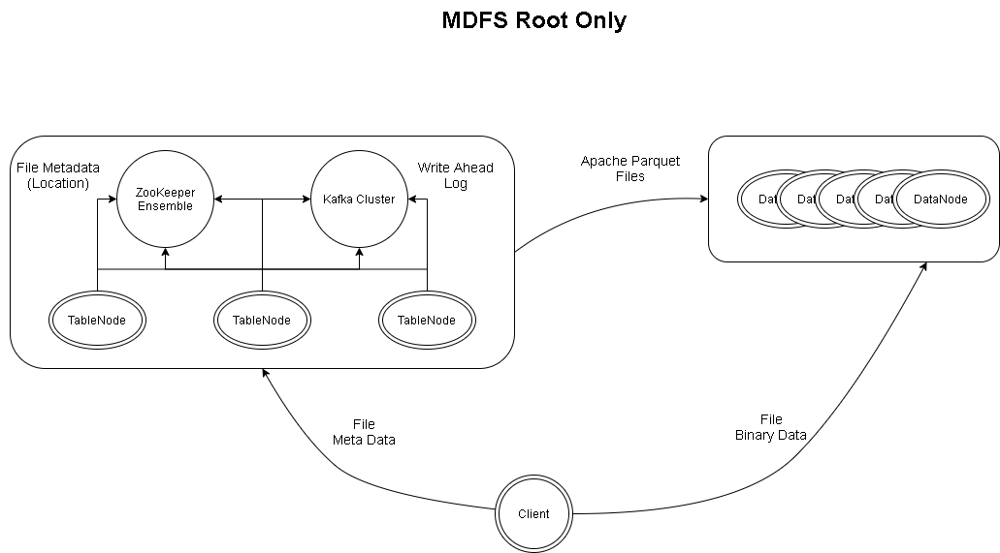
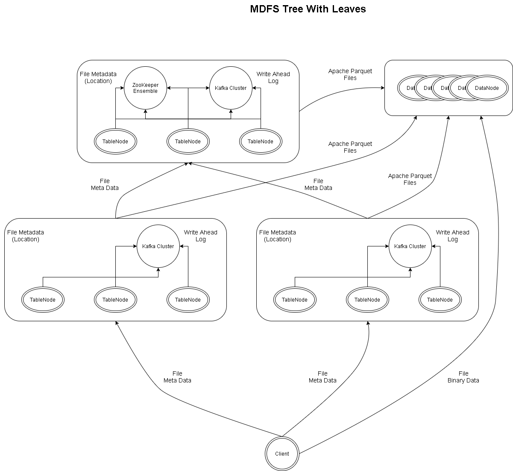

# M Distributed File System (MDFS)

## Overview

Developed based on the Apache Hadoop File System, MDFS was developed to overcome some of the scalability issues of having only a single node
responsible for serving file metadata. To maintain scalability and for simplicity of admnistraton, MDFS acts as a blob store and therefore
relaxes many of the same requirements of HDFS.

MDFS does not currently support object locking for concurrent updates. If two requests are simultaneously made to the same file, the request with the
latest timestamp wins. If this is an issue, you will need to build an object-locking mechanism into your application.

### Distributed Metadata

MDFS borrows from Apache HBase (Google BigTable) by creating a directory of all file information and sharding it across many table nodes.

MDFS table nodes are deployed in pods. A single standard pod contains 3 table nodes, 3 ZooKeeper nodes, and 3 Kafka broker nodes.

Client can safely interact with any table node in the pod.

Much like Apache HBase, each table node has a write ahead log (WAL), a memstore, and a table file. The WAL functionality if provided by
Apache Kafka. All table node write to a single Kafka topic and each table node monitors the topic for updates independently.

File requests written to the WAL are loaded into the memstore and are sorted there based on the ordering of the fully qualified file path. When the
memstore is filled, records are flushed in order to Apache Parquet files on the local disk. Once completed, the files are written to data nodes. The
location of this data is recorded in an external data store.

Over time, these Parquet files are compacted to recover space and to limit the size of the search space for queries. Parquet files are merged
using log-structured merge-tree techniques.

### Distributed Data

MDFS stores metadata and binary data independently. While file metadata is stored in the table nodes, file binary data is stored across many data nodes.
Clients interact directly with data nodes and therefore distribute load across many nodes. Data reads and writes are not funneled through a single node.

### Tree Scaling

Each MDFS cluster has a single root pod. Scalability is achieved by layering instances of MDFS pods on top of existing pods.

Over time, as the MDFS root pod generates and emits Parquet files, the files must be distributed across the data nodes and their locations must be
stored somewhere. The root pod stores this file meta data within Apache ZooKeeper. The file meta data is a relatively low volume affair as files
are only created when the memstore fills or when a merge occurs. Merging files keeps the total number of meta data stored within Apache ZooKeeper
reasonable.

Once a root pod is estabished, this provides the foundation for another level of MDFS pods. Perimeter pods store incoming request to their own instances of
Apache Kafka and they emit Apache Parquet files to MDFS pods in the next-higher level. Scalability is achieved by simply increasing the number of layers in
the cluster where each layer has more pods than its predecessor.

End-point clients only interact with the most outter layer of MDFS pods.

### Data Node Registration and Management

In Apache Hadoop, each data node must connect and ping a single instance of the NameNode. Data nodes transmit status and received directions from the NameNode
through heartbeats. To decouple this process and to allow for sharding meta data across many nodes, Data nodes register with a Apache ZooKeeper ensemble. Table
nodes lookup data node registration information from ZooKeeper and they are responsible for periodically scans each data nodes for status and creates connection
directly to data nodes to direct them to take some sort of action (replicate block, delete block, etc.)

### Block Placement

One of the clever things implemented with HDFS is block locality. That is, the central NameNode detects where the client is located and directs them to transfer
data to the data nodes based on their location as well. With MDFS it is up to the client to determine block placement.

### Data Consistency

With the current implementation of MDFS, both reads and write requests are written to the WAL. In this way, consistency is guaranteed when one client writes to one
table node and another client reads from another. The client read request will be a point-in-time consistent view of the entire data set. However, if there a table
node is experiencing signicant Kafka consumer lag, relative to its peers, reads addressed to this node will block for extended periods of time until the read request
is read from the WAL and processed.

Since a file reads and writes happen in sequence, it is beneficial to keep the data sets maintained by each MDFS Pods small so that load can be better distributed.

### Recovery Time

Since an MDFS Pod has three or more instances of Kafka Brokers, MDFS Table Nodes, and ZooKeeper servers, there is minimal downtime in the event of a system failure.
External clients can simply failover to still-active table node pod members, table nodes can reply on the fault-tolerance inherent in ZooKeeper and Kafka.

Regenerated/repaired Pod members can easily re-join the pod.

### Architecture





## Usage Example

```java

	@BeforeClass
	public static void setup() throws IOException {
		URI rootURI = URI.create("mdfs://test-cluster");
		MdfsFileSystemProvider.instance().newFileSystem(rootURI,
				Collections.singletonMap("hosts", Collections.singleton("127.0.0.1")));
	}

	@Test
	public void testCopyLocalToRemote() throws IOException {
		Path srcPath = Path.of("/home/user/impossibly-cute-puppy-2.jpg");
		URI rootURI = URI.create("mdfs://test-cluster/big-data/14245f31-0ef7-4379-9b9a-304388f3fb12");
		Path dstPath = Paths.get(rootURI);

		Files.copy(srcPath, dstPath);

		LOG.warn("Done");
	}

	@Test
	public void testCopyRemoteToLocal() throws IOException {
		Path dstPath = Path.of("/home/user/impossibly-cute-puppy-2-6.jpg");
		Files.deleteIfExists(dstPath);
		URI rootURI = URI.create("mdfs://test-cluster/big-data/14245f31-0ef7-4379-9b9a-304388f3fb12");
		Path srcPath = Paths.get(rootURI);

		Files.copy(srcPath, dstPath);
	}

	@Test
	public void list() throws IOException {
		URI rootURI = URI.create("mdfs://test-cluster/big-data");
		Path srcPath = Paths.get(rootURI);
		try (DirectoryStream<Path> paths = Files.newDirectoryStream(srcPath)) {
			paths.forEach(path -> LOG.warn("Path: {}", path));
		}
	}
```

## Moving Forwards

### Combining HBase and HDFS

MDFS can be viewed as another BigTable implementation with a data-storage add-on.  As such, a single MDFS cluster could take the role of two and greatly simplify deployments.

HBase relies on HDFS for its WAL implementation. HDFS is a heavy-weight dependency that does not tolerate cloud deployments well. MDFS simplifies the overall architecture by using
the cloud-tested Kafka log system as its WAL provider.  Having Kafka in the stack can also be leveraged to store audit log, and health-and-status log data.

### Cloud Deployments

MDFS lends itself well to cloud deployments. For example, in an environment with three Kafka Brokers and three data centers, data written to the WAL are automatically replicated
across several environments. By also distributing the table nodes, a every data center could have its own local instance of a table node to query.

One of the challenges however is that both Kafka and ZooKeeper have a single instance that serves as the primary gateway for write paths. This means added latency when writing to
environments that do not host the leader. Perhaps, in the future, a radis-based or paxos-based system could store WAL and File Metadata without a single node for write paths.
